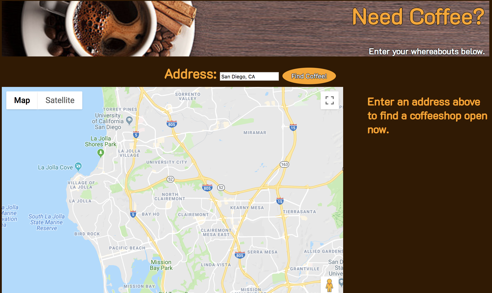
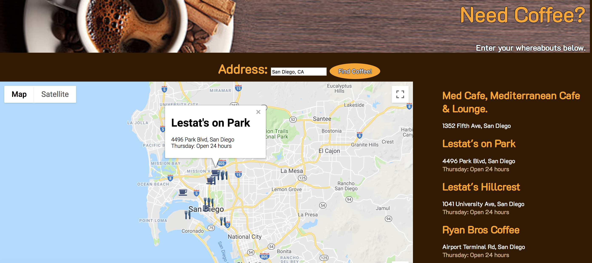

## Coffeeshop Finder.

## Live Link 
Hosted via GitHub Pages:  https://jhull1.github.io/API-Project/

## Motivation

A graduate student always needs caffeine, day or night. It's not always easy to know which shops are open near you at any given moment, so this 
app allows a student to find an open coffee shop near them in real time. This app combines the Google Maps/Places/Details APIs.

## Running a search

Type address in search bar, hit Find Coffee Button. Clicking on any shop name on the left-hand list indicates shop position on map and opens an info window.
When provided, shop name/address/hours are shown.

## Screenshots
Landing Page:

Search Results:

## Built With
* HTML/CSS/JS
